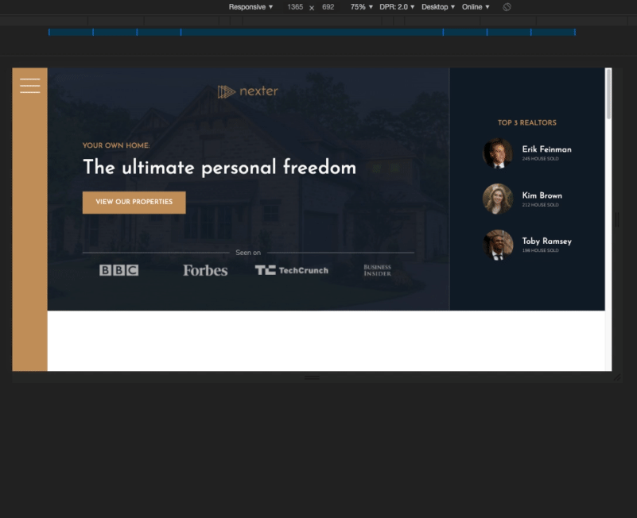

# Advanced CSS & Sass

Many years ago, I taught myself CSS 2 through a combination of W3C documentation and the scarce resources available at the time. Since then, I've been styling with CSS and mostly kept up with the introduction of new selectors, properties, values and concepts.

I had a core understanding of newer concept such as `@media` queries and `flex`, I understood them only through documentation and very light usage, while `grid` was not something I was familiar with at all.

## About the course

Written and presented by the excellent [Jonas Schmedtmann](https://codingheroes.io/) via his Udemy course ["Advanced CSS and Sass: Flexbox, Grid, Animations and more"](https://www.udemy.com/course/advanced-css-and-sass/), this 28 hour course teaches many of the new concepts I was looking to fully understand.

The course has students create 3 basic websites from scratch, each focusing on specific concepts across `@media`, `flex`, `grid` and more. It also aims to teach the basics of NPM and Sass, though I was already familiar with these.

I was able to complete this course in its entirety on June 22, 2020 (I even got a [little certificate](https://www.udemy.com/certificate/UC-e635f622-71ae-489a-a1d8-9d8040b1efa5/)).

## Natours - A showcase of CSS3

This project aims to show how a number of new properties and values introduced in CSS3 function, and how to animate elements and style forms without JavaScript. The project also made heavy use of the [Block Element Modifier (BEM)](http://getbem.com/naming/) naming convetion. Natours is a fictional tour company.

**[See my Natours project here (via rawgit.com)](https://rawgit.com/jakeisonline/udemy-courses/master/advanced-css/natours/index.html)**

This project also educated on how to tackle responsiveness, using both `@media` queries to achieve specific changes at breakpoints, loading different images for different breakpoints and screen DPR, safe-guarding older browsers with `@supports`, and the discipline of using `rem` for font-sizing, dimensions, and spacing.

A full list of all properties and values learned during the project:

`clip-path`, `transform`, `translate`, `skew`, `scale`, `object-fit`, `perspective`, `backface-visibility`, `transition`, `animation`, `outline-offset`, `filter`, `blur()`, `brightness()`, `backdrop-filter`, `column-count`, `shape-outside`, `@keyframes`, `linear-gradient()`, `background-clip`, `cubic-bezier`

## Trillo - Flexible layouts with `flex`

While I had understood what `flex` was, I had never had a chance to full utilise (and understand) how to use it in different layouts. This project used only flex for all layout. Trillo is a fictional holiday company, with this single-page focusing on a hotel listing.

**[See my Trillo project here (via rawgit.com)](https://rawgit.com/jakeisonline/udemy-courses/master/advanced-css/trillo/index.html)**

This project introduced the use of SVG sprites, and just like all projects in this course, responsiveness via `flex` was also addressed.

A full list of all properties and values learned during the project:

`flex`, `flex-direction`, `flex-wrap`, `align-items`, `align-self`, `justify-content`, `var()`, `order`, `fill`, `mask-image`, `mask-size`

## Nexter - Mighty `grid`

`grid` is an entirely new concept to me. While grid-based layouts have been around for a while, I typically implemented them using `float`. Nexter is a fictional real-estate company, with their website laid out using grid.

**[See my Nexter project here (via rawgit.com)](https://rawgit.com/jakeisonline/udemy-courses/master/advanced-css/nexter/index.html)**

And of course, the project also tackled responsiveness.

A full list of all properties and values learned during the project:

`grid`, `grid-row`, `grid-column`, `grid-gap`, `row-gap`, `column-gap`, `grid-template-rows`, `grid-template-columns`, `repeat()`, `minmax()`, `min-content`, `max-content`

## Copyright notice

**All** design content belongs to [Jonas Schmedtmann](https://codingheroes.io/), it cannot be claimed as mine. While all code here was hand written by me, it was done so under the direction of Jonas. Where appropriate, some code was changed either due to W3C documentation changes, or as a matter of taste. 
